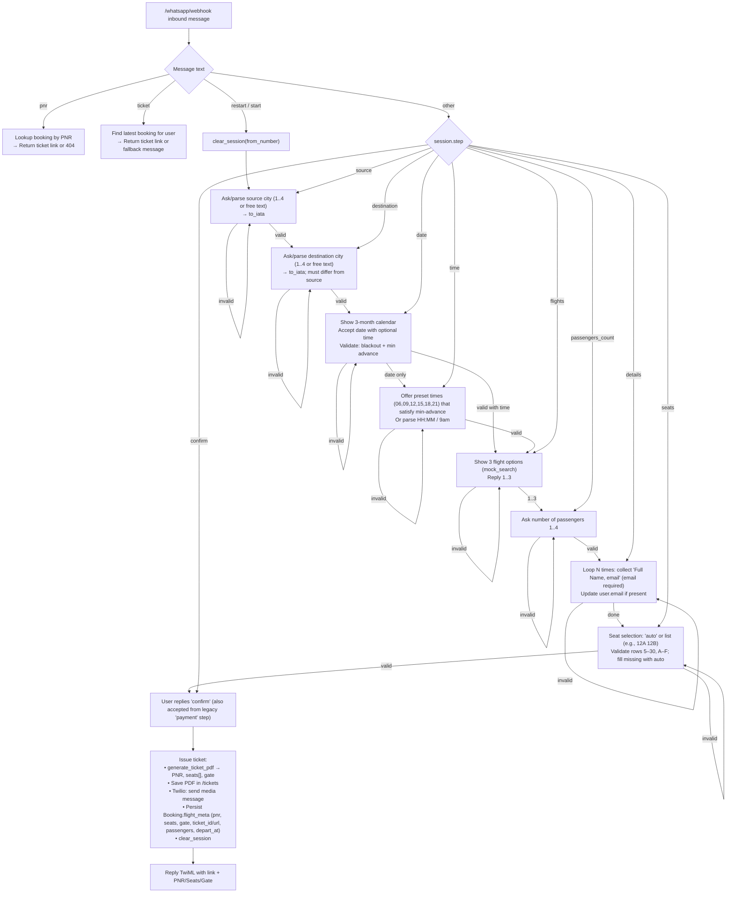
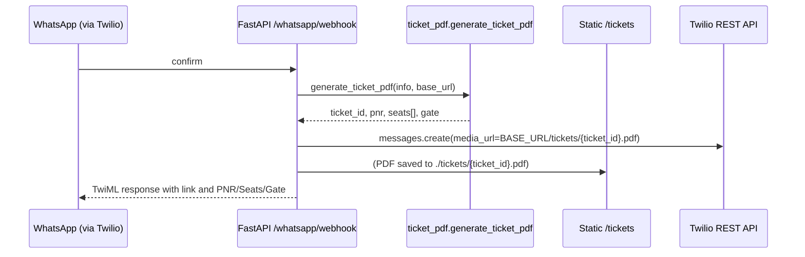

# WhatsApp Flight Booking – Flow Diagrams

Below are Mermaid diagrams describing the major flows implemented in this project.

## 1) Conversation state machine (WhatsApp flow)



## 2) Ticket issuance sequence



## 3) PNR lookup and ticket retrieval

```mermaid
flowchart LR
  A[User sends 'pnr ABC123'] --> B[API scans Booking.flight_meta for PNR]
  B -->|found| C[Return ticket_url]
  B -->|missing| D[Reply 'PNR not found']

  E[GET /booking/{pnr}] --> F[Return JSON: pnr, seats[], gate, ticket_url, depart_at]
  G[GET /tickets/by-pnr/{pnr}.pdf] --> H[Serve ./tickets/{ticket_id}.pdf]
```

## Notes
- Session storage: in-process memory fallback is forced (Redis bypassed) — state is lost on server restart.
- Branding: FROM_NAME, BRAND_PRIMARY, BRAND_LOGO_PATH influence ticket header.
- Date/time rules: MIN_ADVANCE_HOURS and BLACKOUT_DATES from environment.
- Persistence: Bookings saved with flight_meta including pnr, seats, gate, passengers, and departure timestamps.

